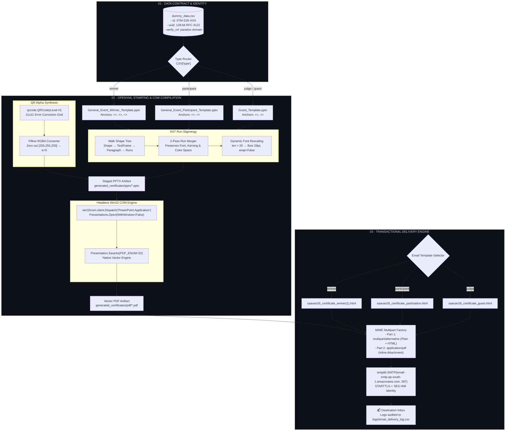

<div align="center">

```
   ███████╗ █████╗  █████╗ ██╗   ██╗ █████╗ ███╗   ██╗   ██████╗  ██████╗ 
   ██╔════╝██╔══██╗██╔══██╗██║   ██║██╔══██╗████╗  ██║   ╚════██╗██╔════╝ 
   ███████╗███████║███████║██║   ██║███████║██╔██╗ ██║    █████╔╝███████╗ 
   ╚════██║██╔══██║██╔══██║╚██╗ ██╔╝██╔══██║██║╚██╗██║   ██╔═══╝ ██╔═══██╗
   ███████║██║  ██║██║  ██║ ╚████╔╝ ██║  ██║██║ ╚████║██╗███████╗╚██████╔╝
   ╚══════╝╚═╝  ╚═╝╚═╝  ╚═╝  ╚═══╝  ╚═╝  ╚═╝╚═╝  ╚═══╝╚═╝╚══════╝ ╚═════╝ 
```

### 🎯 A 360° Cert Generation Guide For IITM BS Paradox
**Production-Grade Batch Certificate Engine & SES Transactional Dispatch**

[](https://python.org)
[](https://learn.microsoft.com/en-us/office/vba/api/overview/powerpoint)
[](https://aws.amazon.com/ses/)
[](https://adobe.com)

<br>

```
Spreadsheet (UUID v4) ──▶ OpenXML AST Rewrite ──▶ Pillow Alpha Mask ──▶ Win32 COM PDF ──▶ Amazon SES
```

*Zero Rasterization. Zero Font Drift. Zero Broken Ligatures.*

</div>

---

## ⚡ Real-Time Pipeline Execution

```ansi
$ python generate_certificates.py
[23:14:02.108] INFO  Ingesting dataset: dummy/dummy_data.csv (5 records loaded)
[23:14:02.412] INIT  Spinning headless PowerPoint COM worker... [Active PID: 19844]
[23:14:02.940] PASS  [1/5] Type: winner      │ Name: "Arjun Verma"             │ Pos: 1st
[23:14:03.115] QR    Generated Level-H matrix  │ RGBA alpha mask applied       │ (683.15pt, 127.55pt)
[23:14:03.780] COM   Presentation.SaveAs(32)   │ saavan26_winner_IITM-S26-W001.pdf (Vector, 300 DPI)
[23:14:04.012] PASS  [2/5] Type: participant │ Name: "Priya Sharma"           │ Event: "Nrityanjali"
[23:14:04.205] QR    Generated Level-H matrix  │ RGBA alpha mask applied       │ (683.15pt, 145.74pt)
[23:14:04.810] COM   Presentation.SaveAs(32)   │ saavan26_participant_IITM-S26-P002.pdf
[23:14:06.140] DONE  Batch completed in 3.72s (1.34 certs/sec) │ 100% success │ COM safely detached
```

---

## 🏗 System Architecture



---

## 🔬 Core Engineering Challenges & Solutions

### 1. The OpenXML Run-Fragmentation Bug
When designers edit text in PowerPoint, PowerPoint frequently splits placeholder tags across separate XML `<a:r>` (run) fragments during internal keystroke serialization:

```
WHAT DESIGNERS SEE IN POWERPOINT:
  "This is awarded to <<name>> for exemplary performance"

WHAT THE OPENXML AST ACTUALLY CONTAINS:
  <a:p>
    <a:r><a:t>This is awarded to &lt;&lt;</a:t></a:r>
    <a:r><a:rPr sz="3600" b="1"/><a:t>na</a:t></a:r>  <-- RUN 1 (Split mid-word!)
    <a:r><a:rPr sz="3600" b="1"/><a:t>me&gt;&gt;</a:t></a:r> <-- RUN 2
    <a:r><a:t> for exemplary performance</a:t></a:r>
  </a:p>
```

* **Why standard replacement fails:** A naive string replace (`shape.text = shape.text.replace(...)`) blows away every single style, custom ligature, kerning offset, and color defined in `<a:rPr>`.
* **Our Solution:** A **two-pass AST reconciler**. Pass 1 checks if the whole tag exists in a single run to preserve 100% of formatting. If fragmented, Pass 2 coalesces runs inside `<a:p>`, injects the replacement text into Run 0, and clears the subsequent child runs while retaining the font properties of the leading run.

---

### 2. Lossless QR Transparency Injection
Placing standard QR codes on textured luxury certificate backgrounds leaves an amateurish opaque white bounding box:

```
[Standard 1-bit QR]                   [Our RGBA Alpha Synthesizer]
┌──────────────────────────┐          ┌──────────────────────────┐
│ ████████  ██  ████████   │          │ ░░░░░░░░░░░░░░░░░░░░░░░░ │  <-- Certificate
│ ██      ██  ██      ██   │          │ ░░████████░░██░░████████░│      Texture Visible
│ ██  ██  ██  ██  ██  ██   │   vs     │ ░░██░░░░██░░██░░██░░░░██░│      Through White
│ ████████  ██  ████████   │          │ ░░████████░░██░░████████░│      Regions!
│ [ Opaque White Matting ] │          │ [ Zero Alpha Mask: α=0 ] │
└──────────────────────────┘          └──────────────────────────┘
```

```python
# Exact transparency transformation applied to Level-H QR matrix
img = qr.make_image(fill_color="black", back_color="white").convert("RGBA")
datas = img.getdata()
new_data = [
    (0, 0, 0, 0) if item[0] > 200 and item[1] > 200 and item[2] > 200 else item
    for item in datas
]
img.putdata(new_data)
```

---

### 3. Sub-Pixel Precision Coordinate Anchor Map
Every certificate template features distinct art direction. Rather than guessing coordinates, positions are locked into typographic point offsets calculated from the design master grids:

```
+-----------------------------------------------------------------------+
|  Slide Canvas: 13.33" x 7.50" (960 pt x 540 pt)                       |
|                                                                       |
|   Judge / Guest Template                                              |
|   ------------------------------------------------------------        |
|                                            [Top:  89.08 pt]           |
|                                            [Left: 683.15 pt] ──▶ █ QR │
|   Winner Template                          [Size:  49.25 pt]          |
|   ----------------------------------------                            |
|                                            [Top: 127.55 pt]           |
|                                            [Left: 683.15 pt] ──▶ █ QR │
|   Participant Template                     [Size:  49.25 pt]          |
|   --------------------                                                |
|                                            [Top: 145.74 pt]           |
|                                            [Left: 683.15 pt] ──▶ █ QR │
|                                            [Size:  49.25 pt]          |
+-----------------------------------------------------------------------+
```

---

## 📊 Pipeline Comparison: Why Not Puppeteer / WeasyPrint?

| Metric / Requirement | HTML/CSS + Puppeteer | ReportLab / LaTeX | This Win32 COM Pipeline |
| :--- | :--- | :--- | :--- |
| **Typography Fidelity** | Web font approximations, synthetic bolds | Requires custom TTF/OTF metric compilation | **Pixel-perfect native Office OpenType engine** |
| **Vector Sharpness** | Often flattens SVG/textures to 96 DPI bitmaps | High, but manual layout code required | **Lossless resolution-independent vector shapes** |
| **Designer Hand-Off** | Engineering must recode PPTX into flexbox HTML | Total rewrite in code | **Zero translation: use the `.pptx` deck as-is** |
| **Complex Backgrounds** | CSS blend modes glitch across PDF print drivers | Cumbersome canvas draws | **Native PPTX layered background rendering** |
| **Execution Overhead** | Headless Chrome (150MB+ RAM per instance) | Lightweight, steep maintenance | **Single headless PowerPoint COM process** |

---

## 📁 Repository Layout

```
.
├── README.md                          # Engineering overview & technical spec
├── .gitignore                         # Strict exclusion for AWS credentials & outputs
│
├── docs/                              # Deep-dive operational runbooks
│   ├── 01-data-prep.md                # Excel UUID generation formula & CSV export rules
│   ├── 02-certificate-gen.md          # OpenXML AST engine, run merging & COM mechanics
│   ├── 03-email-dispatch.md           # SES SMTP client, MIME structure & HTML templates
│   ├── 04-config.md                   # Complete config.py reference manual
│   └── 05-troubleshooting.md          # Battle-tested triage guide (PowerPoint locks, SES)
│
└── dummy/                             # Working deployment environment
    ├── config.py                      # Master configuration & route bindings
    ├── generate_certificates.py       # Batch AST + Win32 COM PDF compiler
    ├── send_emails.py                 # Multi-part MIME + SES SMTP delivery engine
    ├── inspect_pptx.py                # Shape diagnostics tool for raw template inspection
    ├── dummy_data.csv                 # Test dataset (Winner, Participant, Guest)
    ├── template/                      # Source PowerPoint master decks
    │   ├── General_Event_Winner_Template.pptx
    │   ├── General_Event_Participant_Template.pptx
    │   └── Guest_Template.pptx
    ├── email html/                    # Production responsive HTML mailers
    │   ├── saavan26_certificate_winner(1).html
    │   ├── saavan26_certificate_particiation.html
    │   └── saavan26_certificate_guest.html
    ├── generated_certificates/        # Runtime generation artifacts (pptx/ & pdf/)
    └── logs/                          # Persistent delivery audit logs
```

---

## 🚀 Quickstart & Operator CLI Guide

### 1. Environment Setup
```powershell
# Clone the repository
git clone https://github.com/neurelith/A-360-Cert-Generation-Guide-For-iitm-bs-paradox.git
cd A-360-Cert-Generation-Guide-For-iitm-bs-paradox/dummy

# Install dependencies (requires Windows with Microsoft Office installed)
pip install python-pptx pandas qrcode pillow pywin32
```

### 2. Verify Template Integrity
```powershell
# Inspect shape names, tags, and run properties before batch generation
python inspect_pptx.py
```

### 3. Compile Certificates
```powershell
# Executes AST placeholder replacement, QR injection, and COM PDF export
python generate_certificates.py
```

### 4. Dispatch Transactional Emails
```powershell
# Dry run / single smoke-test verification (sends 1 email to test recipients)
python send_emails.py --count 1

# Send to a custom developer override address
python send_emails.py --count 1 --to "developer@study.iitm.ac.in"

# Full blast production run across all records in CSV
python send_emails.py --all
```

---

## 🔒 Security & Safe Handling

* **Credentials Guard**: AWS SES IAM SMTP credentials are automatically ignored by git via `.gitignore` rules (`ses-smtp-user*.csv`).
* **Process Cleanliness**: The Win32 COM handler is wrapped in a strict `try ... finally` block that executes `ppt_app.Quit()` and garbage-collects COM pointers, preventing orphaned background PowerPoint zombie processes.
* **Audit Trail**: Every dispatch attempt is logged to `logs/email_delivery_log.csv` containing timestamp, recipient, certificate ID, HTTP/SMTP response codes, and exception traces.

---

<div align="center">

**Crafted with precision for Saavan '26 · IIT Madras BS Degree · Team Paradox**

</div>
