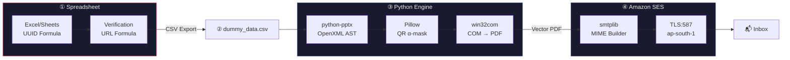

<div align="center">

# 🎯 A 360° Cert Generation Guide

**Batch certificate pipeline for IITM BS Paradox · Saavan '26**


<br>

*Spreadsheet → PPTX template injection → Vector PDF → Transactional email*<br>
*No Puppeteer. No WeasyPrint. No rasterization. Pure PowerPoint COM.*

</div>

---

<br>

## The Problem

Design team hands you polished `.pptx` decks with custom serif typography, textured backgrounds, and precise print bleeds. You need to stamp 500+ unique names, generate QR verification codes, compile vector PDFs, and email each one — **without destroying the design**.

HTML-to-PDF tools (Puppeteer, WeasyPrint) rasterize or miscalculate font metrics on typefaces like Roxborough-CF and Crimson Pro. The kerning breaks, ligatures vanish, vectors get flattened to 96dpi bitmaps.

This pipeline skips all of that. It treats the `.pptx` as the source of truth, manipulates the OpenXML AST directly with `python-pptx`, and drives the real PowerPoint application over Windows COM to compile PDFs that match exactly what the designer signed off on.

<br>

## Architecture



<br>

## Pipeline Internals

<details>
<summary><b>Phase 1 — UUID & Verification URL (Excel formulas, zero code)</b></summary>

<br>

Generate tamper-proof identifiers directly in the spreadsheet. No scripts needed.

**UUID formula** (Column H):
```
=UPPER(CONCATENATE(
  DEC2HEX(RANDBETWEEN(0,4294967295),8), "-",
  DEC2HEX(RANDBETWEEN(0,65535),4), "-",
  DEC2HEX(RANDBETWEEN(16384,20479),4), "-",
  DEC2HEX(RANDBETWEEN(32768,49151),4), "-",
  DEC2HEX(RANDBETWEEN(0,65535),4),
  DEC2HEX(RANDBETWEEN(0,4294967295),8)
))
```

**Verification URL** (Column I):
```
="https://saavan.iitmparadox.org/verify?cert=" & H2
```

> ⚠️ `RANDBETWEEN` is volatile. **Paste as Values immediately** or every UUID regenerates on each edit.

Full schema + export rules → [`docs/01-data-prep.md`](docs/01-data-prep.md)

</details>

<details>
<summary><b>Phase 2 — Certificate Generation (the gnarly part)</b></summary>

<br>

```bash
python generate_certificates.py
```

What happens under the hood:

**Template routing** — CSV `type` field maps to the right deck:

| Type | Template | Placeholders |
|:-----|:---------|:-------------|
| `winner` | `General_Event_Winner_Template.pptx` | `<<name>>` `<<position>>` `<<event_name>>` |
| `participant` | `General_Event_Participant_Template.pptx` | `<<name>>` `<<event_name>>` |
| `judge`/`guest` | `Guest_Template.pptx` | `<<name>>` `<<event_name>>` |

**Run fragmentation fix** — PowerPoint splits `<<name>>` across multiple XML runs internally:
```xml
<a:r><a:t>&lt;&lt;na</a:t></a:r>
<a:r><a:t>me&gt;&gt;</a:t></a:r>
```
Two-pass regex: try single-run replacement first (preserves formatting), fall back to paragraph-level collapse if fragmented.

**Long name scaling** — Names over 20 chars get proportionally shrunk (floor: 28pt) with `word_wrap` disabled. Prevents layout breaks on names like *"Karri Nagendra Sai Jaya Rami Reddy"*.

**QR transparency** — Level-H error correction QR → Pillow RGBA pixel scan → white pixels zeroed to `α=0`. No ugly white squares on textured backgrounds.

**PDF compilation** — Headless PowerPoint COM: `Presentations.Open(path, WithWindow=False)` → `.SaveAs(pdf, 32)`. Single instance reused across the entire batch. `try/finally` kills the process even on crash.

Full internals → [`docs/02-certificate-gen.md`](docs/02-certificate-gen.md)

</details>

<details>
<summary><b>Phase 3 — Email Dispatch (SES + type-matched HTML)</b></summary>

<br>

```bash
python send_emails.py --count 1          # smoke test
python send_emails.py --all              # full blast
python send_emails.py --to "me@test.com" # override recipient
```

**Template matching** — each cert type gets its own responsive HTML email:

```
Winner      → saavan26_certificate_winner(1).html     (prize badge, rank ribbon)
Participant → saavan26_certificate_particiation.html   (event recognition)
Judge/Guest → saavan26_certificate_guest.html          (formal appreciation)
```

**MIME structure:**
```
MIMEMultipart("mixed")
├── MIMEMultipart("alternative")
│   ├── text/plain  (fallback)
│   └── text/html   (rendered body)
└── application/pdf (certificate attachment)
```

**Placeholders injected:** `{{StudentName}}` `{{EventName}}` `{{Position}}` `{{WinningPrize}}` `{{CertificateID}}` `{{CertificateLink}}` `{{FeedbackLink}}` `{{DiscrepancyFormLink}}`

Every transaction logged to `logs/email_delivery_log.csv` with timestamp, status, and error detail.

Full details → [`docs/03-email-dispatch.md`](docs/03-email-dispatch.md)

</details>

<br>

## Quickstart

```bash
pip install python-pptx pandas qrcode pillow pywin32
```

```bash
cd dummy

python inspect_pptx.py           # verify template placeholders
python generate_certificates.py  # PPTX → PDF
python send_emails.py --count 1  # test 1 email
python send_emails.py --all      # send everything
```

<br>

## Repo Map

```
.
├── README.md
├── .gitignore
│
├── docs/
│   ├── 01-data-prep.md           # Excel formulas, CSV schema, export rules
│   ├── 02-certificate-gen.md     # PPTX engine: run splitting, QR masks, COM PDF
│   ├── 03-email-dispatch.md      # SES config, HTML templates, MIME, CLI flags
│   ├── 04-config.md              # config.py reference
│   └── 05-troubleshooting.md     # 9 real failure modes + fixes
│
└── dummy/                        # working directory
    ├── config.py                 # SMTP creds, paths, template maps, QR coords
    ├── generate_certificates.py  # cert engine (233 lines)
    ├── send_emails.py            # email dispatcher (259 lines)
    ├── inspect_pptx.py           # template shape inspector
    ├── dummy_data.csv            # 5 test rows × 3 cert types
    ├── template/                 # 3 master PPTX decks
    ├── email html/               # 3 responsive HTML templates
    ├── generated_certificates/   # output: pptx/ + pdf/
    └── logs/                     # delivery audit trail
```

<br>

## QR Anchor Coordinates

Each template has a unique vertical layout. QR placement is calibrated in typographical points:

```
                    ┌──────────────────────────────────┐
                    │          Certificate              │
                    │                                   │
   Judge/Guest ───▶ │  ■ QR   top: 89.08 pt            │
                    │                                   │
       Winner ───▶  │  ■ QR   top: 127.55 pt           │
                    │                                   │
  Participant ───▶  │  ■ QR   top: 145.74 pt           │
                    │                                   │
                    │         left: 683.15 pt (all)     │
                    │         size: 49.25 pt  (all)     │
                    └──────────────────────────────────┘
```

<br>

## Stack

| Layer | Tool | Why |
|:------|:-----|:----|
| Data | Pandas | CSV parsing, row iteration |
| Template | python-pptx | OpenXML shape traversal, run-level text replacement |
| QR | qrcode + Pillow | Level-H matrix generation, RGBA alpha transparency mask |
| PDF | win32com (PowerPoint COM) | Native vector export, no rasterization |
| Email | smtplib + email.mime | MIME multipart construction, TLS transport |
| Delivery | Amazon SES (ap-south-1) | Transactional SMTP, verified sender identity |

<br>

## Why Not HTML → PDF?

| | HTML/CSS + Puppeteer | This pipeline |
|:-|:---------------------|:-------------|
| Font fidelity | Browser font fallbacks, metric approximation | Native OpenType rendering by PowerPoint |
| Vector output | Rasterized at screen DPI | True vector shapes + embedded fonts |
| Designer workflow | Rewrite PPTX as responsive HTML | Use the PPTX directly |
| Transparency | CSS `mix-blend-mode` quirks | Pillow pixel-level alpha mask |
| Print quality | 96–150 dpi typical | Vector, resolution-independent |

<br>

---

<div align="center">

**Built for Saavan '26 · IIT Madras BS Degree · Team Paradox**

</div>
