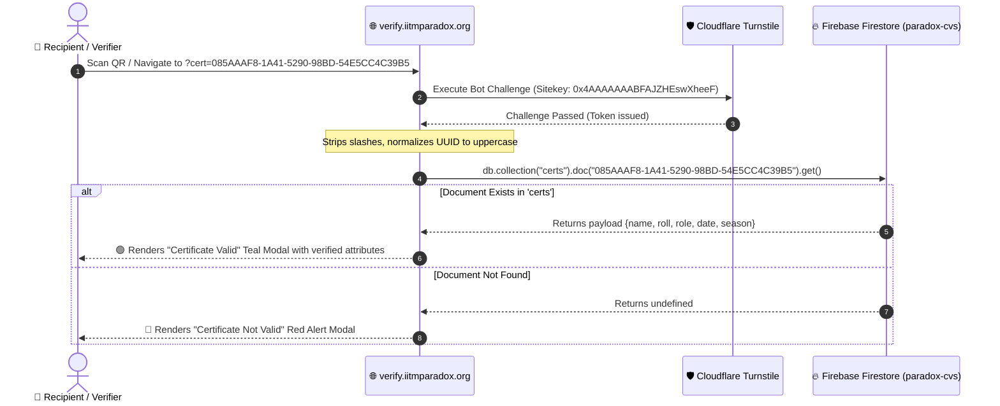

# Step 2 — Certificate Verification & Validation

The certificate verification process is the trust layer of the entire pipeline. Every certificate issued for Saavan '26 contains an encrypted, tamper-proof QR code linking to the official verification portal. 

Anyone scanning the QR code or clicking the verification link in their email can independently verify the authenticity of the award in real time.

---

## 🏛 Verification Architecture



---

## 🔍 How Verification Works (Client-Side)

The verification portal operates on a lightweight, secure client-side architecture:

1. **Query Parameter Extraction**:
   When the page loads, `app.js` extracts the `cert` parameter from the URL:
   ```javascript
   let params = new URLSearchParams(location.search);
   let val = params.get("cert");
   ```

2. **Cloudflare Turnstile CAPTCHA**:
   To prevent automated scraping, denial of service, and brute-force harvesting of certificate IDs, the verify button is locked until Cloudflare Turnstile validates the visitor:
   ```javascript
   window.turnstileCb = function () {
     document.getElementById("cert_id").value = val;
     var turnstileOptions = {
       sitekey: "0x4AAAAAAABFAJZHEswXheeF",
       callback: function (token) {
         cap = true;
         document.getElementById("opener").disabled = false;
         if (document.getElementById("cert_id").value) {
           document.getElementById("opener").click();
         }
       }
     };
     turnstile.render(".cf-turnstile", turnstileOptions);
   };
   ```

3. **Firestore Lookup**:
   Once verified by Turnstile, the application sanitizes the certificate ID and performs a direct document lookup on the `certs` collection:
   ```javascript
   cert_id = cert_id.replace(/\//g, "").toUpperCase();
   const certs = db.collection("certs").doc(cert_id);
   certs.get().then((doc) => {
     const data = doc.data();
     if (data == undefined) {
       // Display "Certificate Not Valid"
     } else {
       // Render Name, Issued Date, Roll Number, Role, Season
     }
   });
   ```

---

## 🗄 Firestore Data Schema

Each document in the `certs` collection represents one issued certificate. The **Document ID** is the exact uppercase UUID.

```json
{
  "085AAAF8-1A41-5290-98BD-54E5CC4C39B5": {
    "name": "Krishna",
    "date": "May 2026",
    "roll": "25f2007055@ds.study.iitm.ac.in",
    "role": "Winner",
    "season": "Saavan '26",
    "cert_id": "SAAVAN26-W-0001",
    "event": "Stand-Up Comedy Showdown"
  }
}
```

### Schema Attributes:

| Field | Type | Description | Displayed in Verification Modal |
|:------|:-----|:------------|:--------------------------------|
| `name` | string | Candidate's full name | **Yes** — Displays under **Name** |
| `date` | string | Month/Year of issue (e.g. `May 2026`) | **Yes** — Displays under **Issued On** |
| `roll` | string | Roll number or student email | **Yes** — Displays under **Roll Number** |
| `role` | string | Role / Position (`Winner`, `First Runner Up`, `Participant`, `Judge`) | **Yes** — Displays under **Role** |
| `season` | string | Festival season (`Saavan '26`) | **Yes** — Displays under **Season** |
| `cert_id` | string | Certificate ID code (`SAAVAN26-W-0001`) | Internal audit record |
| `event` | string | Event title (`Stand-Up Comedy Showdown`) | Internal audit record |

---

## 🛡️ Pre-Flight Dataset Validation

Before generating slides or compiling PDFs, the dataset **must pass automated integrity checks**. Running PowerPoint COM on malformed data wastes hours and produces invalid QR codes.

Use the validation utility:

```bash
cd dummy
python validate_and_verify.py --csv dummy_data.csv
```

### What gets audited:
1. **Schema Integrity**: Verifies all 12 mandatory columns exist and column headers have no accidental trailing whitespace.
2. **Missing Values**: Flags any empty or whitespace-only cells in critical fields (`cert_id`, `name`, `email`, `type`, `uuid`, `qr_code`).
3. **Uniqueness**: Guarantees zero duplicate `cert_id`, zero duplicate `uuid`, and zero duplicate `qr_code` entries.
4. **RFC 4122 v4 Format**: Enforces the 128-bit hexadecimal pattern `^[0-9A-F]{8}-[0-9A-F]{4}-[0-9A-F]{4}-[0-9A-F]{4}-[0-9A-F]{12}$`.
5. **URL & UUID Coherence**: Asserts that `qr_code` explicitly matches `https://saavan.iitmparadox.org/verify?cert=` + `uuid`.
6. **Email Syntax**: Flags invalid or suspicious email patterns before SES attempts delivery.
7. **Type Routing**: Verifies `type` resolves to a known template (`winner`, `participant`, `judge`, `guest`).

---

## 🔄 Syncing Records to the Verification Database

Once the dataset is validated, the records must be ingested into Firestore so that recipients scanning their QR codes immediately see valid results.

### 1. Compile the Firestore Ingestion Payload
Run the validation script with the `--export-firestore` flag:

```bash
python validate_and_verify.py --csv dummy_data.csv --export-firestore firestore_certs_payload.json
```

This compiles a clean JSON batch file where keys are Document IDs (UUIDs) and values are the formatted document payloads.

### 2. Batch Upload to Firestore
Use the official Firebase Admin SDK or Cloud Function to batch-write documents:

```python
import json
import firebase_admin
from firebase_admin import credentials, firestore

# Initialize using system environment or service account
# CRITICAL: DO NOT commit serviceAccountKey.json or .env to version control!
cred = credentials.Certificate("path/to/serviceAccountKey.json")
firebase_admin.initialize_app(cred)
db = firestore.client()

with open("firestore_certs_payload.json", "r", encoding="utf-8") as f:
    certs_data = json.load(f)

batch = db.batch()
count = 0

for uuid_key, payload in certs_data.items():
    doc_ref = db.collection("certs").doc(uuid_key)
    batch.set(doc_ref, payload)
    count += 1
    
    # Firestore batch limit is 500 writes
    if count % 450 == 0:
        batch.commit()
        batch = db.batch()
        print(f"Committed {count} records...")

batch.commit()
print(f"Successfully uploaded {count} certificates to Firestore.")
```

---

## 🔒 Security Best Practices

> [!CAUTION]
> **Never commit `.env` or service account credentials to Git!**
> 
> The `.gitignore` is pre-configured to strictly ignore:
> - `.env`, `.env.*`, `*.env`
> - `serviceAccountKey*.json`, `*credentials*.json`
> - `*payload*.json`, `firestore_*.json`
> 
> Keep all database write credentials in your local environment or AWS Secrets Manager.

---

## ✅ Post-Generation Reconciliation

After running `generate_certificates.py`, verify that 100% of candidates have a compiled PDF and matching verification record:

```bash
python validate_and_verify.py --csv dummy_data.csv --check-pdfs
```

Output:
```
=================================================================
  SAAVAN '26 — CERTIFICATE VALIDATION & VERIFICATION RUNNER
=================================================================
[*] Auditing 5 rows from dummy_data.csv...
[v] Dataset Integrity: 100% PASS (All schemas, UUIDs & URLs verified)

[*] PDF Reconciliation against generated_certificates/pdf:
    - Matched: 5/5 PDFs
    [v] 100% of PDFs accounted for.

[+] Verification & validation check complete.
```
